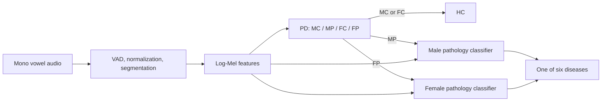

# Pipeline: what each step does

The public package and historical paper artifacts serve different roles. `src/gehirnet/` is the reusable implementation; `experiments/` preserves the original experiments. Historical notebook execution still requires its original environment/path setup.

| Step | Input | Operation | Output | Entry point |
| --- | --- | --- | --- | --- |
| 1. Acquire and curate | Source vowel /a/ recordings and source metadata | Select the paper's diseases; inspect spectrograms and document exclusions | Curated recording list | Manual/source-specific; see `data/README.md` |
| 2. Establish splits | Original segment lists, or source participant IDs | Preserve original lists for historical comparison; establish participant splits for a new study | Fixed train/test tables | Source-specific; `gehirnet audit` checks paths and dataset/ID overlap |
| 3. Remove silence | Mono waveform | RMS VAD: window 2048, hop 512, threshold 0.001; fade and crossfade voiced regions | Voiced waveform | `preprocessing.remove_silence` |
| 4. Normalize and segment | Voiced waveform | Min-max [0,1] before slicing; one-second clips, step 0.4 seconds; wrap-pad the last clip | Audio segments | `preprocessing.segment_audio`, `gehirnet prepare` |
| 5. Balance training data | Training segments only | Resampling or five-part permutation/crossfade; balance each classifier's training set | Stage-specific augmented audio and provenance | `augmentation.py` primitives; archived balancing scripts |
| 6. Extract features | Original/augmented segments | Sample-rate-dependent FFT/hop, 128 Mel bins, power-to-dB conversion | `(1,128,98)` `.npy` features and a segment CSV | `gehirnet prepare` for original recordings; augmented preparation is still offline |
| 7. Train | Feature CSV + task config | Five-fold stratified CV; select mean final-epoch MCC; retrain on all supplied training rows | `model.pth`, `training.json` | `gehirnet train` |
| 8. Evaluate | Fixed test features + selected checkpoint(s) | Binary PD, seven-class baseline, or hard-routed hierarchy | Accuracy, weighted F1, MCC, confusion matrix, predictions | `gehirnet evaluate` |
| 9. Aggregate runs | Same test cohort evaluated for seeds 40/41/42 | Mean and explicitly chosen standard deviation convention | Aggregate JSON | `scripts/summarize_metrics.py` |
| 10. Distribute/use | Validated checkpoint(s) and documented provenance/terms | Assemble manifest, class order, preprocessing and SHA-256 checksums | Model bundle | `gehirnet bundle`; `predict --model-dir` loads it |

## Three classifiers

All three classifiers are independently trained ResNet-50 models. MP/FP receive the original Mel tensor. No hidden-feature transfer, joint end-to-end loss or probability multiplication is implemented by the historical inference pipeline.

PD checkpoint order is `MC, MP, FC, FP`. MP/FP order is `ALS, Covid-19, Dysphonie, Laryngitis, Parkinson, Rekurrensparese`. Healthy outputs append HC as index 6 in the hierarchy. The single-stage baseline has HC at index 3, so its checkpoint must be loaded explicitly as baseline.

## Preparation boundaries

`prepare` processes the recording list you supply and produces original features. It does not acquire datasets, choose exclusions, recover historical splits, balance classes or infer participant identities. Split assignments, augmentation lineage and manual selection must be supplied/documented separately. New filenames and in-memory audio processing are not asserted to reproduce archived feature bytes exactly.

`predict` processes raw WAVs with the same reusable preprocessing, but does not perform the manual spectral quality screening from the paper. All results are per segment; no whole-recording voting rule is assumed.

The paper performs manual outlier inspection on spectrograms after silence removal. The recording preparation helper accepts the already curated inclusion list; it does not implement an interactive inspection stage.
